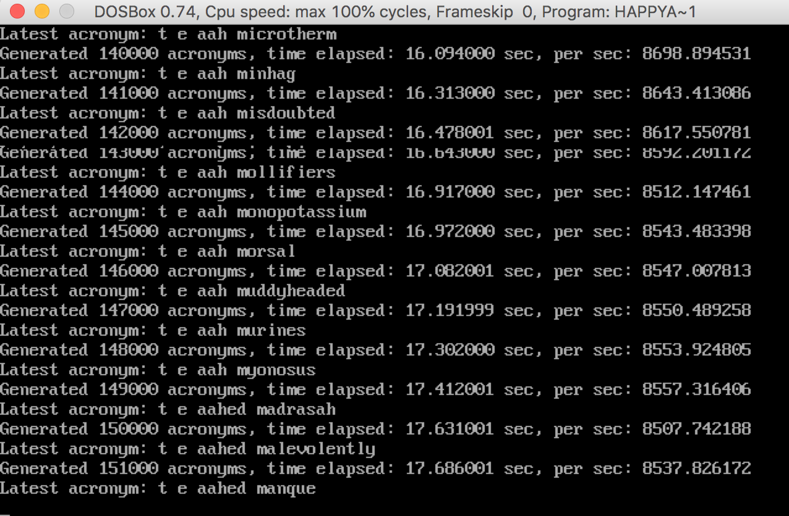

#

# happyacro-dos

A c++ motivational acronym generator.

This program creates motivational acronyms for an acronym you specify. 

It's not going to print out every generated acronym. It's basically a funny / shitty benchmark joke for a [book](http://www.happyacro.com).

This program's purpose is to run on [DOSBox](https://www.dosbox.com/) while emulating old PCs [XT/286/386/486 etc).

# Running

There are two pre-built versions of happyacro provided with the project in the [bin](bin) folder: 

1. [happyacro.exe](bin/happyacro.exe) is the DOS executable built from the C code in this project within a Win98 VM (more on that hell below in the **Building The Masochistic Version For DOSBox** section of this document. 

2. [happyacromac](bin/happyacromac) is an executable for MacOs built from the C++ code in this project on MacOs High Sierra in 2018. 

Usage for both versions is as follows: 

	USAGE: happyacro <acronym>  <reporting interval> <word file>

- the acronym is the motivational acronym you want to generate from such as TEAM
- the reporting interval controls how often output is generated
- the word file is a file containing words to use, one word per line 

I've added an example word file named [words.txt](bin/words.txt) to use with the program to this repo. That file comes from the [english-words github repo](https://github.com/dwyl/english-words), which in turn extracted the words from [this excel file from infochimps](http://www.infochimps.com/datasets/word-list-350000-simple-english-words-excel-readable). Infochimps owns the copyright to the words file. 

# Running on an [emulated] old box

Instructions for tuning dosbox emulation to emulate an 8086 [or 80386) accurately: 

https://www.dosbox.com/wiki/4.77_MHz

Check [here](https://en.wikipedia.org/wiki/List_of_Intel_microprocessors) to see the mhz of various old computers.

NOTE: Keep in mind that x86 processors weren't 32 bit until the 386, so we're technically cheating when we run the 32-bit version of the program on DOSBox at a speed below 386 speeds to emulate older hardware.

# Building For Modern Systems

If you want to build the program on modern hardware. Install gcc on your system and run `g++ happyacro.cpp -o happyacro` to build it.

# Building The Masochistic Version For DOSBox

I was trying to run this thing on DOSBox, which is an emulator for old versions of MS-DOS. That required a number of hoops to jump through for building it:

1. I tried to compile the c++ version with djgpp, turbo c++ (various versions), microsoft c/c++ (various versions), borland c++ on dosbox, watcom, and others. Don't bother.
2. Learned that c++ standard library wasn't standardized until after the products mentioned above existed.
3. Didn't want to write some weird compiler-specific c++ variant, so decided to write in C. 
4. Fired up a Windows 98 VM on VirtualBox ([instructions here](Win982018VM.md)).
6. Installed [Open Watcom 1.9](http://www.openwatcom.org) on the Win98 image.
7. Created an Open Watcom project with a target environment of "Dos - 32-bit" and Image Type "Causeway Executable [.exe]".
8. Wrote the c version of the program, compiling and checking if it'd work in the DOSBox image along the way. 
9. Built the c version, ftped it over to my OSX box in my dosbox directory, and ran it in DOSBox. 

# Fun Facts

I received the following results running this program: 

- Emulated Machine: 1979 8086 @ 5MHz (DOSBox Cycle Setting: 250 cycles). Output: 315 acronyms per second.
- Emulated Machine: 1982 80286 @ 12MHz (DOSBox Cycle Setting: 1250 cycles). Output: 1,580 acronyms per second.
- Emulated Machine: 1985 80386 @ 33MHz (DOSBox Cycle Setting: 3250 cycles). Output: 4,100 acronyms per second.
- Emulated Machine: 1989 80486 @ 66MHz (DOSBox Cycle Setting: 7250 cycles). Output: 9,100 acronyms per second.
- Emulated Machine: 1992 80486DX2 @ 100MHz (DOSBox Cycle Setting: 12750 cycles). Output: 15,500 acronyms per second.
- Emulated Machine: 1997 Pentium 1 @ 166MHz (DOSBox Cycle Setting: 20500 cycles). Output: 24,800 acronyms per second.  
- Non-emulated Machine: 2014 MacBookPro11,2 Intel(R) Core(TM) i7-4980HQ CPU @ 2.80GHz (single threaded). Output: 2,000,000 acronyms per second.

*Run configuration:*

- All runs were done with the word "team" as the acronym
- Word file is from [here](https://github.com/dwyl/english-words). It has ~470K words in a 4MB text file.
- I ran with print frequency of 100,000.

*Emulated Environment Notes*

- Environment: DOSBox 0.74 running on MacBook Pro Late 2014 15" model.
- I used the [TOPBENCH](https://dosbenchmark.wordpress.com/) instead of MIPS.COM program as directed [here](ttps://www.dosbox.com/wiki/4.77_MHz) and played with the configured cycle count to get DOSBox operating close to the desired clock speed for each run. MIPS.COM's math gets funny after the multiplier goes over 25x. 
- Executable for emulated machines was compiled with the open watcom 1.9 compiler mentioned earlier in this document.

*Non-Emulated Enviornment Notes*

- Executable for non-emulated machine was compiled with `g++ happyacro.cpp` (gcc didn't like undefined _max fn in the .c version, so I was lazy and compiled .cpp, whatever).

# License

The [words.txt](bin/words.txt) file in this repo comes from the [english-words github repo](https://github.com/dwyl/english-words), which in turn extracted the words from [this excel file from infochimps](http://www.infochimps.com/datasets/word-list-350000-simple-english-words-excel-readable). Infochimps owns the copyright to the that file. 

All remaining content is licensed with the [Apache license](http://en.wikipedia.org/wiki/Apache_license), which is a great license because it:

* a) covers liability - my code should work, but I'm not liable if you do something stupid with it
* b) allows you to copy, fork, and use the code, even commercially
* c) is [non-viral](http://en.wikipedia.org/wiki/Viral_license), that is, your derivative code doesn't *have to be* open source to use it

Other great licensing options for your own code: [BSD License](https://en.wikipedia.org/wiki/BSD_licenses), [MIT License](https://en.wikipedia.org/wiki/MIT_License), or [Creative Commons](https://en.wikipedia.org/wiki/Creative_Commons_license).

Here's the license:

Copyright [c) 2017, Coder Cowboy, LLC. All rights reserved.

Redistribution and use in source and binary forms, with or without
modification, are permitted provided that the following conditions are met:
* 1. Redistributions of source code must retain the above copyright notice, this
list of conditions and the following disclaimer.
* 2. Redistributions in binary form must reproduce the above copyright notice,
this list of conditions and the following disclaimer in the documentation
and/or other materials provided with the distribution.
  
THIS SOFTWARE IS PROVIDED BY THE COPYRIGHT HOLDERS AND CONTRIBUTORS "AS IS" AND
ANY EXPRESS OR IMPLIED WARRANTIES, INCLUDING, BUT NOT LIMITED TO, THE IMPLIED
WARRANTIES OF MERCHANTABILITY AND FITNESS FOR A PARTICULAR PURPOSE ARE
DISCLAIMED. IN NO EVENT SHALL THE COPYRIGHT OWNER OR CONTRIBUTORS BE LIABLE FOR
ANY DIRECT, INDIRECT, INCIDENTAL, SPECIAL, EXEMPLARY, OR CONSEQUENTIAL DAMAGES
[INCLUDING, BUT NOT LIMITED TO, PROCUREMENT OF SUBSTITUTE GOODS OR SERVICES;
LOSS OF USE, DATA, OR PROFITS; OR BUSINESS INTERRUPTION) HOWEVER CAUSED AND
ON ANY THEORY OF LIABILITY, WHETHER IN CONTRACT, STRICT LIABILITY, OR TORT
[INCLUDING NEGLIGENCE OR OTHERWISE) ARISING IN ANY WAY OUT OF THE USE OF THIS
SOFTWARE, EVEN IF ADVISED OF THE POSSIBILITY OF SUCH DAMAGE.
  
The views and conclusions contained in the software and documentation are those
of the authors and should not be interpreted as representing official policies,
either expressed or implied.